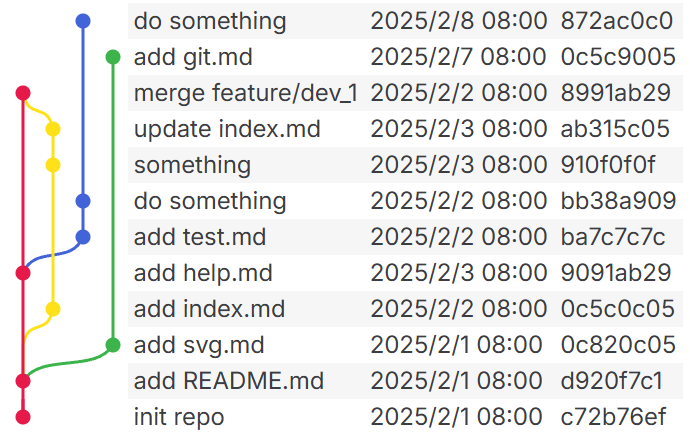
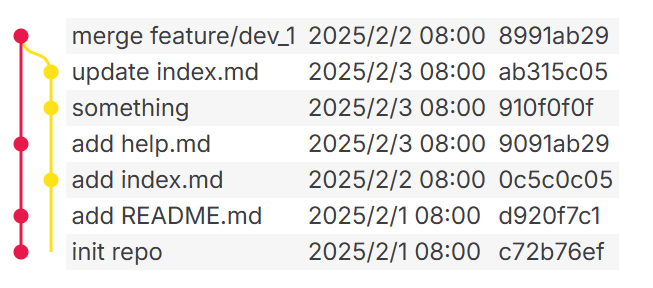
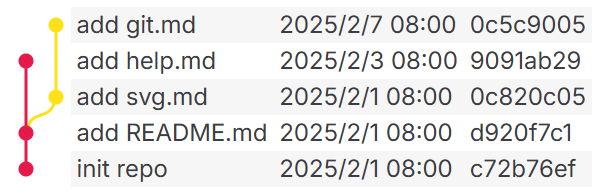
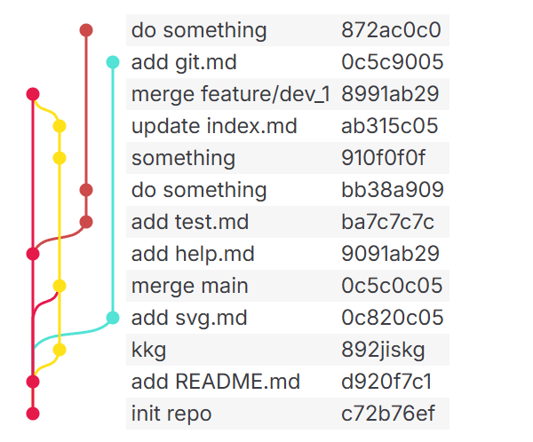

# markdown-it-git-graph

一个`markdown-it`插件，用于在 markdown 文档中插入 `git graph`

## 安装

```bash
npm install markdown-it-git-graph
```

## 使用

```ts
import MarkdownIt from 'markdown-it'
import { gitGraphPlugin } from 'markdown-it-git-graph'

const md = new MarkdownIt()
  .use(gitGraphPlugin)

const text = md.render(`\`\`\`git-graph
[main]
8991ab29<ab315c05   'merge feature/dev_1'    2025-02-02
9091ab29            'add help.md'            2025-02-03
d920f7c1            'add README.md'          2025-02-01
c72b76ef            'init repo'              2025-02-01
[feature/dev_1]
ab315c05            'update index.md'        2025-02-03
910f0f0f            'something'              2025-02-03
0c5c0c05<d920f7c1   'add index.md'           2025-02-02
[feature/dev_2]
872ac0c0            'do something'           2025-02-08
bb38a909            'do something'           2025-02-02
ba7c7c7c<9091ab29   'add test.md'            2025-02-02
[feature/dev_3]
0c5c9005            'add git.md'             2025-02-07
0c820c05<d920f7c1   'add svg.md'             2025-02-01
\`\`\``)
```

使用` ```git-graph `标注代码块，然后再代码块中，上面的结果示例：



### 分支

使用中括号指定分支名称，若不指定默认名称为 `main`，分支名称占一行，commit信息需要另起一行。
````
```git-graph
[main]
commit1 something
[dev]
commit2 something
```
````

### 提交

提交信息分三段，以空格分隔。第一段为提交hash值，或者唯一id，第二段为提交信息，第三段为提交时间，时间可以不添加，默认为0。

- hash: 提交的hash值，或者当前代码块内唯一id，字符串类型，如果需要包含空格需要将整个hash段用单引号包裹。

- message: 提交的信息，字符串类型，如果需要包含空格需要将整个message段用引号包裹。

- time: 提交的时间，毫秒值，整数，或者可以通过`Date.parse('2025-05-24')`解析的时间格式，默认为0。

````
```git-graph
commit1 'this is a commit message' 78968
commit2 'this is a commit message' 2025-05-24
```
````

### 合并记录

在`hash`段指定合并记录，格式为`hash1<hash2`，表示`hash1`所在的分支合并了`hash2`。 例如：下面的示例中，`main`分支合并了`dev`分支的代码，创建了`8991ab29`这个合并记录。同时也表示`8991ab29`是由`ab315c05`和`9091ab29`两个提交合并而来的。结果展示如图所示。

````
```git-graph
[main]
8991ab29<ab315c05   'merge feature/dev_1'    2025-02-02
9091ab29            'add help.md'            2025-02-03
d920f7c1            'add README.md'          2025-02-01
c72b76ef            'init repo'              2025-02-01
[feature/dev_1]
ab315c05            'update index.md'        2025-02-03
910f0f0f            'something'              2025-02-03
0c5c0c05            'add index.md'           2025-02-02
```
````



### 新建分支

新建分支，并在新分支上提交一个提交记录，那么这个提交记录我们可以看作是上游分支与空分支的合并的结果，所以格式和合并记录一样，`hash1<hash2`。例如：下面的示例中`dev`分支从`main`分支的`d920f7c1`提交记录创建。

````
```git-graph
[main]
8991ab29<ab315c05   'merge feature/dev_1'    2025-02-02
9091ab29            'add help.md'            2025-02-03
d920f7c1            'add README.md'          2025-02-01
c72b76ef            'init repo'              2025-02-01
[feature/dev_3]
0c5c9005            'add git.md'             2025-02-07
0c820c05<d920f7c1   'add svg.md'             2025-02-01
```
````



## 配置

| 参数 | 类型 | 描述 |
| --- | --- | --- |
| defaultBranchName    | string                      | 默认分支名称                                          |
| theme                | SvgTheme                    | Svg主题设置                                          |
| theme.colors         | string[]                    | 颜色列表，优先使用的颜色列表，分支数超出时，使用随机颜色  |
| theme.lineHeight     | number                      | 每条提交信息的展示高度，默认 24                                       |
| theme.lineWidth      | number                      | 分支线间距，默认 20                                   |
| theme.pointRadius    | number                      | 点半径，默认 5                                        |
| theme.dateFormat     | Intl.DateTimeFormatOptions  | 日期格式                                             |
| theme.columns        | ('hash' | 'message' | 'date')[] | 展示的字段 |

### 全局配置 

```ts
const md = MarkdownIt().use(GitGraphPlugin, {
  defaultBranchName: 'main',
  theme: {
    colors: [
      '#e6194b',
      '#ffe119',
      '#4363d8',
      '#3cb44b',
      '#f58231',
      '#911eb4',
      '#46f0f0',
      '#f032e6',
      '#bcf60c',
      '#fabebe',
      '#008080',
      '#e6beff',
    ],
    lineHeight: 24,
    lineWidth: 20,
    pointRadius: 5,
    columns: ['message', 'date', 'hash'],
    dateFormat: {
      dateStyle: 'short',
      timeStyle: 'short',
    },
  }
})
```

### 局部配置 

对于每个图块，可以在其内部添加配置项。配置项对于该图块有效，将覆盖全局配置。

````
```git-graph colors=#e6194b,#ffe119&columns=message,hash
[main]
8991ab29<ab315c05   'merge feature/dev_1'    2025-02-02
9091ab29            'add help.md'            2025-02-03
d920f7c1            'add README.md'          2025-02-01
c72b76ef            'init repo'              2025-02-01
[feature/dev_1]
ab315c05            'update index.md'        2025-02-03
910f0f0f            'something'              2025-02-03
0c5c0c05<d920f7c1   'add index.md'           2025-02-02
[feature/dev_2]
872ac0c0            'do something'           2025-02-08
bb38a909            'do something'           2025-02-02
ba7c7c7c<9091ab29   'add test.md'            2025-02-02
[feature/dev_3]
0c5c9005            'add git.md'             2025-02-07
0c820c05<d920f7c1   'add svg.md'             2025-02-01
```
````



### 引入样式

需要引入样式文件或者直接添加样式到页面中，否则样式会丢失。例如在`vitepress`中引入样式

```ts
import type { Theme } from 'vitepress'
import DefaultTheme from 'vitepress/theme'
import 'markdown-it-git-graph/styles/index.css'

export default <Theme>{
  extends: DefaultTheme,
  enhanceApp: async () => {},
}

```
